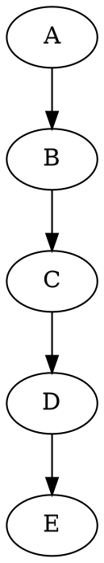

# fatec_tarefas
## Auditoria de Sistemas

### 1. Principais aspectos relacionados a auditoria de sistema de informação e segurança

### 2. Principais mecanismos e estratégias de auditoria
Aula de 27/02/2023

+------------+        +------------+        +------------+
|            |        |            |        |            |
|   Entrada  +------->+  Processo  +------->+   Saída    |
|            |        |            |        |            |
+------------+        +------------+        +------------+

 1. Verificar: consiste em avaliar se o sistema de informação está operando conforme as normas, procedimentos e padrões estabelecidos;

 2. Validar: refere-se a garantir a correção e precisão das informações processadas pelo sistema;

 3. Conformidade: busca avaliar se as práticas de segurança da informação estão em conformidade com as normas e regulamentos aplicáveis;

 4. Confidencialidade: garantir que as informações estejam acessíveis apenas a pessoas autorizadas;

 5. Integridade: garantir que as informações estejam completas, precisas e consistentes;

 6. Disponibilidade: garantir que as informações estejam acessíveis aos usuários autorizados quando necessário;

 7. Autenticidade: garantir que as informações sejam genuínas e originadas de fontes confiáveis;

 8. Não-repúdio: garantir que a autoria das informações não possa ser negada posteriormente;

 9. Legalidade: verificar se o sistema está em conformidade com as leis e regulamentações aplicáveis;

 10. Eficiência: avaliar se o sistema está sendo utilizado de maneira eficiente e se os processos estão otimizados;

 11. Eficácia: avaliar se o sistema está atendendo às necessidades e expectativas dos usuários e da organização como um todo;

 12. Rastreabilidade: garantir que seja possível rastrear a origem e o destino das informações e das transações realizadas no sistema.