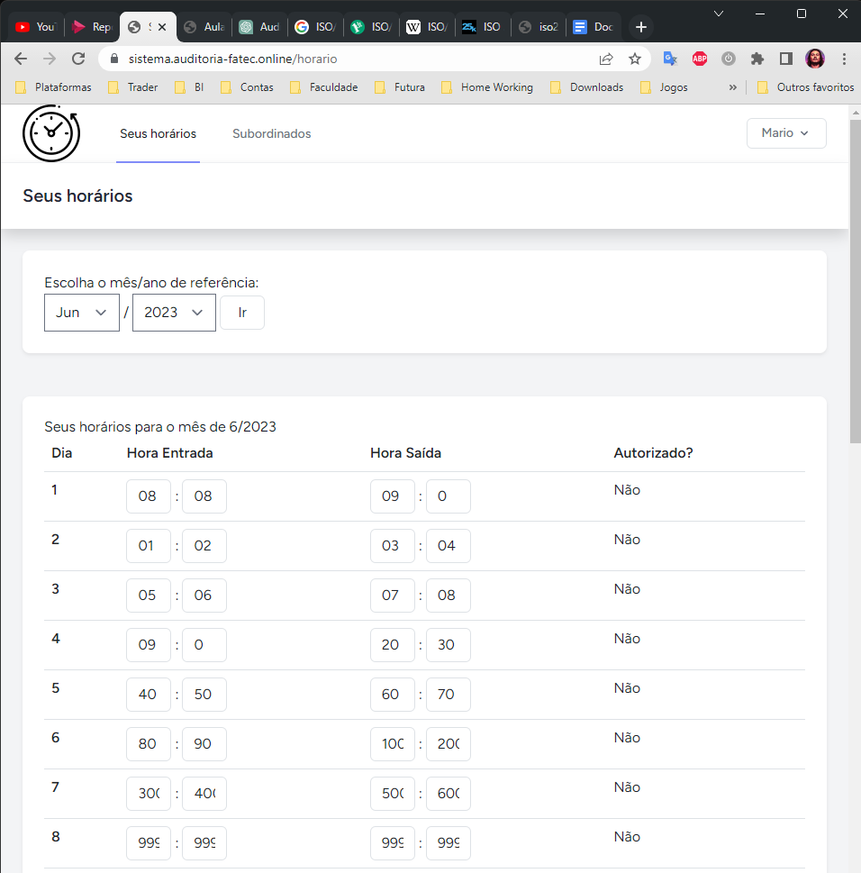
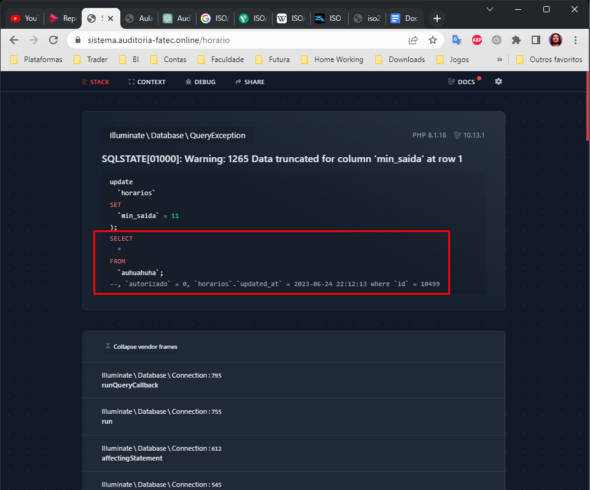

# Relatório de Auditoria de Sistema

- Data: 24 de junho de 2023
- Auditor: Hadston A. M. Nunes
- Sistema auditado: Sistema de Horários [sistema.auditoria-fatec.online](https://sistema.auditoria-fatec.online/horario)

Este relatório apresenta os resultados da auditoria realizada no sistema "**Sistema de Horários** [sistema.auditoria-fatec.online](https://sistema.auditoria-fatec.online/horario)". O objetivo da auditoria foi identificar conformidades e/ou não-conformidades em relação às melhores práticas de segurança e funcionamento do sistema, avaliar os riscos associados e fornecer um catálogo formal de achados. As descobertas e recomendações destacadas neste relatório fornecem uma visão geral do estado atual do sistema auditado.

## 1. Introdução

Esta seção fornece uma visão geral do sistema auditado, descrevendo seu propósito, escopo e principais características. Também é apresentada uma breve descrição dos objetivos e metodologia da auditoria.

O presente relatório de auditoria tem como objetivo fornecer uma análise abrangente do sistema de horários auditado, destacando suas principais características, escopo e propósito. A auditoria foi conduzida com o intuito de avaliar a conformidade do sistema com os requisitos estabelecidos, identificar áreas de não conformidade e fornecer recomendações para melhorias.

### 1.1. Visão geral do sistema auditado

O sistema de horários em análise é uma aplicação desenvolvida para gerenciar e acompanhar os horários dos usuários. Seu objetivo principal é fornecer uma plataforma eficiente para a criação, edição e visualização de horários de forma precisa e confiável. Através do sistema, os usuários podem registrar seus horários de entrada e saída, permitindo um controle mais eficiente e organizado de suas atividades.

### 1.2. Escopo da auditoria

A auditoria foi realizada na versão atual do sistema de horários, abrangendo as funcionalidades relacionadas ao registro de horas, à criação, edição e exibição de horários pelo usuário. O escopo considerou apenas a restrição de tempo para preenchimento dos horários, **validações destes dados** e o **comprometimento dos cálculos de horas**, buscando identificar eventuais inconsistências ou falhas que possam comprometer a integridade e confiabilidade dos horários registrados.

### 1.3. Metodologia da auditoria

A auditoria foi conduzida seguinda uma abordagem sistemática, utilizando técnicas e métodos reconhecidos para a análise de sistemas, como a revisão da documentação e testes funcionais. O objetivo foi obter uma compreensão aprimorada das características e funcionalidades do sistema, permitindo uma avaliação mais criteriosa e abrangente.

Ao longo deste relatório, serão apresentadas as principais descobertas resultantes da auditoria, categorizadas como conformidades e não conformidades em relação aos requisitos estabelecidos e às melhores práticas. Também serão identificados os riscos associados a cada achado e fornecidas recomendações específicas para corrigir ou mitigar os problemas identificados.

## 2. Conformidades e não-conformidades

Durante a auditoria do sistema de controle de horas, foram identificadas conformidades e não conformidades relacionadas às funcionalidades analisadas. Os achados estão organizados abaixo, acompanhados por uma descrição detalhada, evidências coletadas e referências às melhores práticas ou normas aplicáveis:

### 2.1. Registro de Horas

- Conformidade: O sistema permite que os funcionários preencham os horários de trabalho dos dias do mês corrente;
- Não conformidade: Não há validação do prazo para preenchimento dos horários. Funcionários podem adicionar ou editar registros mesmo após o período de 24 horas após a saída;
- Evidências: A análise do código fonte e a simulação de adição e edição de registros após o prazo estabelecido comprovam a falta de restrição;
- Referências: Segundo as normas de qualidade[2] esta funcionalidade não satisfaz as necessidades do requisito não sendo adequada pra capacitar o funcionamento do produto.

### 2.2. Registro de Autorização

- Conformidade: O sistema permite que os superiores façam a checkagem e autorizem os horários de trabalho do dia de seu subordinado no mês corrente;
- Não conformidade: Não há validação do prazo para a autorização dos horários. Os supervisores podem fazer esta revisão após o período de 72 horas após o final do mês anterior;
- Evidências: A análise do código fonte e a simulação de checkagem e edição de registros após o prazo estebelecido comprovam a falta de restrição;
- Referências: Segundo as normas de qualidade[2] esta funcionalidade não satisfaz as necessidades do requisito não sendo adequada pra capacitar o funcionamento do produto.

## 3. Análise de risco

Com base nas não-conformidades identificadas, é realizada uma análise de risco para avaliar o impacto potencial das falhas encontradas. São considerados os aspectos de integridade do sistema. A análise de risco inclui a identificação dos ativos afetados, as ameaças envolvidas, a probabilidade de ocorrência e o impacto resultante. Esta análise permite priorizar as ações corretivas necessárias para mitigar os riscos.

### 3.1. Identificação dos Riscos

Na identificação dos riscos é listado os riscos relacionados às não-conformidades identificadas durante a auditoria. Cada risco está descrito de forma clara e objetiva.

- Risco 1: Erros e inconsistências nos registros de horários devido à falta de validação durante o preenchimento;
- Risco 2: Comprometimento dos cálculos e dos pagamentos devido à ausência de restrições na alteração de registros do mês anterior;
- Risco 3: Queda da moral dos funcionários e aumento da rotatividade devido a pagamentos errados ou inconsistentes;

### 3.2. Avaliação dos Riscos

Para cada risco identificado, segue uma avaliação da probabilidade de ocorrência e a gravidade caso o risco se concretize. Será utilizada uma escala de três probabilidades e três gravidades para atribuir valores a estes parâmetros.

#### 3.2.1 Risco 1

- Probabilidade: Alta;
- Gravidade: Média;

#### 3.2.2. Risco 2

- Probabilidade: Moderada;
- Gravidade: Alta;

### 3.2.3. Risco 3

- Probabilidade: Alta;
- Gravidade: Alta;

### 3.3. Classificação dos Riscos

- Risco 1: Média Criticidade;
- Risco 2: Média Criticidade;
- Risco 3: Alta Criticidade;

## 4. Recomendações

Com base nas conformidades e não-conformidades identificadas, são apresentadas recomendações específicas para melhorar a eficiência e a funcionalidade do sistema. Cada recomendação é acompanhada de uma justificativa clara e orientações práticas sobre como implementá-la. As recomendações devem ser consideradas como medidas corretivas para tratar as não-conformidades e melhorar o desempenho geral do sistema. Aqui é identificado medidas de mitigação que possam reduzir a probabilidade de ocorrência dos riscos ou minimozar o impacto caso eles ocorram. Ações corretivas são sugeridas para abordar os riscos identificados.

### 4.1 Medidas de Mitigação para o Risco 1

- Implementar validações durante o preencimento dos horários, garantindo que os registros sejam adicionados ou editados dentro do prazo estabelecido;
- Realizar testes de integridade nos registros para identificar erros ou inconsistências;

### 4.2 Medidas de Mitigação para o Risgo 2

- Estabelecer retrições na alteração de registros do mês anterior após um prazo definido, garantindo a confiabilidade dos cálculos e dos pagamentos;
- Realizar verificações periódicas nos registros para identificar alterações não autorizadas;

### 4.3 Medidas de Mitigação para o Risco 3

- Implementar controles de qualidade nos cálculos de pagamentos. Realizar testes e validações adicionais nos cálculos de pagamento, utilizando métodos de verificação cruzada e garantindo a precisão dos resultados. Isto ajudará a reduzir erros e inconsistências nos pagamentos;
- Estabelecer canais de comunicação eficientes. Criar canais de comunicação claros e acessíveis para os funcionários reportarem quaisquer problemas ou discrepâncias nos pagamentos. Isso permitirá que as questões sejam prontamento identificadas e corrigidas, demonstrando um comprometimento da empresa em resolver possíveis falhas.

## 5. Conclusão

A auditoria realizada no sistema de controle de horas identificou diversas conformidades e não-conformidades relacionadas às funcionalidades analisadas. Estas descobertas forneceram insights valiosos sobre os pontos fortes e áreas de melhoria do sistema, permitindo à equipe responsável tomar medidas corretivas adequadas. Os resultados da auditoria revelaram que o sistema possui um mecanismo de registro de horas adequado, garantindo a edição e acompanhamento contínuo do horário dos funcionários. No entanto, foram identificadas não-conformidades relacionadas à falta de restrições de acesso, permitindo que funcionários visualizem e alterem os horários de trabalho de forma indevida.
Constatou-se a ausência de validações durante o preenchimento dos horários de trabalho, o que pode levar a erros e inconsistências nos registros. Também foram identificadas falhas na restrição de alteração de registros do mês anterior, compromentendo a integridade dos cálculos e dos pagamentos. Com base nas categorias de riscos identificadas, foi realizada uma análise de risco, avaliando a probabilidade de ocorrência e o impacto associado a cada risco. Isso permitiu identificar áreas críticas que exigem atenção imediata, bem como a priorização das medidas de mitigação.
Para mitigar os riscos identificados, são recomendadas medidas como implementação de validações durante o preenchimento dos horários, restrições na alteração de registro do mês anterior, entre outras ações para garantir a precisão e integridade dos dados.
É importante ressaltar que a implementação destas medidas de mitigação contribuíra para fortalecer a confiabilidade e a segurança do sistema de controle de horas, evitando problemas como pagamento incorretos, insatisfação dos funcionários e possível aumento da rotatividade.
Em suma, a auditoria realizada permitiu uma análise abrangente do sistema de controle de horas, destacanto os pontos fortes e áreas de melhoria. Com as recomendações apresentadas neste relatório, a equipe responsável tem uma base sólidade para realizar as melhorias necessárias e garantir a eficiência e confiabilidade do sistema, bem como a satisvação dos usuários e o cumprimento das políticas e regulamentações aplicáveis.

## 6. Anexos

Os anexos incluem documentação adicional relevante, como evidências coletadas, entre outros documentos que apoiam as descobertas e recomendações apresentadas no relatório. Incluindo um teste de injeção[3] de código malicioso nas consultas SQL do sistema de horário.

| Descrição | Anexo |
| :-- | :-: |
| Captura de tela demonstrando a possibilidade salvar dados inconsistêntes |  |
| Captura de tela demonstrando ainda a possibilidade de injeção de código malicioso |  |

## 8. Referência

[1] A ISO/IEC 25010 e sua Importância para a Qualidade de Software, [OneDayTesting Blog](https://blog.onedaytesting.com.br/iso-iec-25010/), 24 de junho de 2023.

[2] Norma de Qualidade ISO/IEC 9126, [Wikipédia ISO/IEC 9126](https://pt.wikipedia.org/wiki/ISO/IEC_9126), 24 de junho de 2023.

[3] Injeção de SQL: Um Guia para Principiantes para Usuários do WordPress, [Kinsta](https://kinsta.com/pt/blog/injecao-sql/), 24 de junho de 2023.
