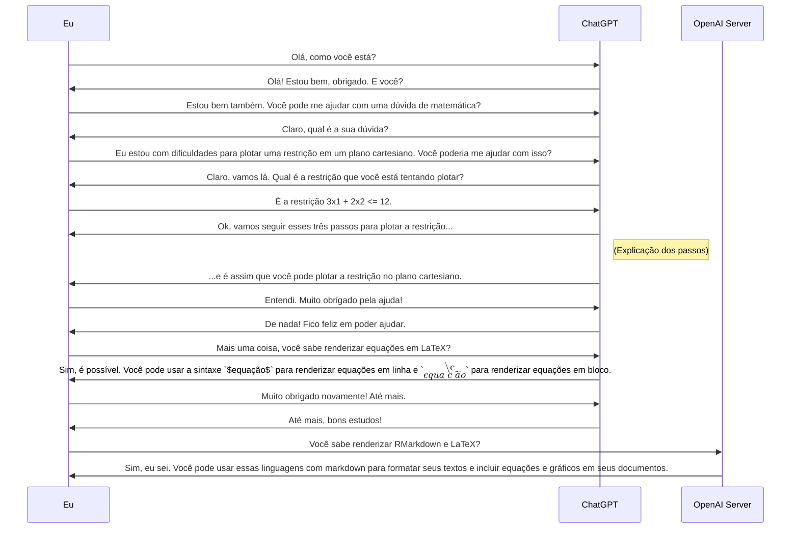
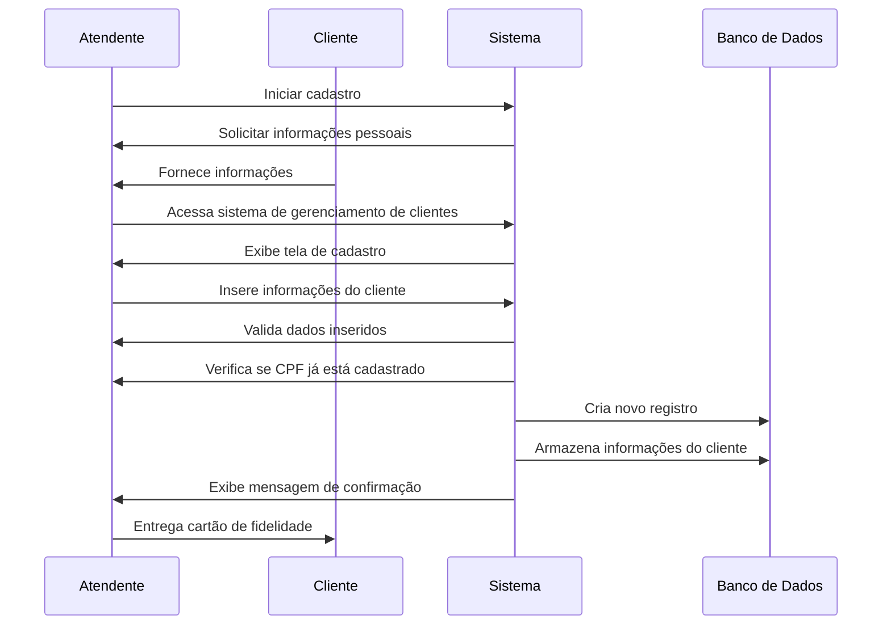

# Diagramas Mermaid

[Mermaid Live Editor](https://mermaid.live/)



## Diagramas de Sequência Cadastrar Cliente

O atendente da loja inicia o processo de cadastro do cliente;
O atendente solicita as informações pessoais do cliente;
O cliente fornece as informações solicitadas;
O atendente acessa o sistema de gerenciamento de clientes;
O sistema exibe a tela de cadastro;
O atendente insere as informações do cliente nos campos correspondentes;
O sistema valida os dados inseridos;
O sistema verifica se o CPF do cliente já está cadastrado;
O sistema cria um novo registro para o cliente;
O sistema armazena as informações do cliente no banco de dados;
O sistema exibe uma mensagem de confirmação do cadastro;
O atendente entrega um cartão de fidelidade ao cliente.



```
