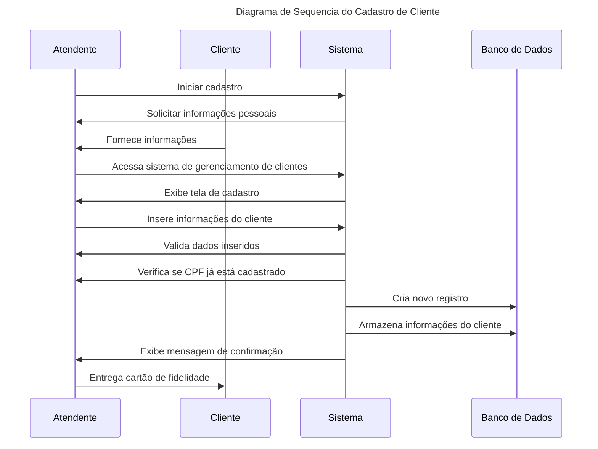

# Diagramas Mermaid

[Mermaid Live Editor](https://mermaid.live/)

## 1. Conceitos Mermaid

O Mermaid é uma ferramenta de código aberto que permite criar diagramas a partir de texto, utilizando uma sintaxe simples. É uma biblioteca javascript que permite criar diagramas com código markdown. O objetivo é facilitar a criação de diagramas e a sua manutenção, já que os diagramas são armazenados no formato markdown.

Para usar o Mermaid, basta criar um arquivo markdown e adicionar o código do diagrama. O código do diagrama deve ser inserido entre as tags ```mermaid e ```.

## 2. Diagrama de Caso de Uso

Diagrama de caso de uso é uma ferramenta da UML (Unified Modeling Language) utilizada para descrever o comportamento funcional de um sistema a partir da perspectiva do usuário. É uma representação gráfica que mostra as interações entre o usuário e o sistema em questão, bem como as relações entre os diferentes casos de uso e seus atores.

### 2.1 Ambiente para o Vendedor

#### Narrativa

O vendedor acessa o sistema utilizando suas credenciais de login, que podem ser obtidas através do cadastro pelo Google ou pelo cadastro direto no sistema. Assim, tem acesso a todas as funcionalidades do ambiente do vendedor, incluindo o cadastro de clientes, cadastro de produtos, controle dos fiados, envio de cobranças e registro dos pagamentos. O vendedor pode também gerar relatórios de vendas e resultados por período, bem como visualizar a vitrine inicial com os indicadores de resultados.

#### Diagrama


### 2.2 Ambiente para o Cliente

#### Narrativa

O cliente acessa o sistema utilizando suas credenciais de login, e um token recebido através de um convite. O cliente tem acesso às suas informações de cadastro, como nome, endereço e histórico de compras, a funcionalidade de comprar fiado pelo QRCode, bem como o pagamento dos fiados via PIX. O cliente pode também visualizar seus fiados em aberto e os produtos disponíveis na loja.

#### Diagrama


### 2.3 Cadastro de Clientes

#### Narrativa

O usuário seleciona a opção de cadastro de clientes e preenche os campos com as informações solicitadas. As informações são validadas e armazenadas na API do Firebase, que é responsável pelo armazenamento dos dados dos clientes.

#### Diagrama


### 2.4 Cadastro de Produtos

#### Narrativa

O usuário seleciona a opção de cadastro de produto e preenche os campos com as informações solicitadas, incluindo o QRCode do produto. As informações são validadas e armazenadas na API do Firebase.

#### Diagrama


### 2.5 Relatório de Produtos com QRCode

#### Narrativa

O usuário seleciona a opção de relatório de produtos com QRCode e pode visualizar um relatório com os produtos cadastrados no sistema, incluindo as informações de cada produto e o QRCode correspondente.

#### Diagrama


### 2.6 Comprar Fiado pelo QRCode

#### Narrativa

O cliente seleciona a opção de comprar fiado pelo QRCode e escaneia o QRCode do produto desejado. O sistema verifica se o cliente tem limite de crédito disponível e autoriza a compra, que é registrada na API do Firebase.

#### Diagrama


### 2.7 Controle dos Fiados

#### Narrativa

O usuário seleciona a opção de controle dos fiados e pode visualizar os fiados em aberto de todos os clientes cadastrados no sistema. O usuário pode gerenciar os fiados, incluindo a geração de cobranças individuais e em lote, bem como o registro dos pagamentos recebidos.

#### Diagrama


### 2.0 Lista de Narrativas

- Narrativa para Envio de Cobrança Individual:
O usuário seleciona a opção de envio de cobrança individual e seleciona o cliente e o produto desejado. O sistema gera uma cobrança individual, que é enviada ao cliente via e-mail ou SMS.

- Narrativa para Envio de Cobrança em Lote:
O usuário seleciona a opção de envio de cobrança em lote e seleciona um grupo de clientes e produtos. O sistema gera uma cobrança em lote, que é enviada aos clientes via e-mail ou SMS.

- Narrativa para Integração com o PIX:
O sistema é integrado à API do PIX e permite o pagamento dos fiados via PIX. O cliente pode selecionar a opção de pagar via PIX e escanear o QRCode gerado pelo sistema. O pagamento é registrado na API do Firebase.

- Narrativa para Registro dos Pagamentos:
O usuário seleciona a opção de registro dos pagamentos e pode registrar os pagamentos recebidos de cada cliente, incluindo a forma de pagamento (PIX, dinheiro, cartão, etc.) e a data do pagamento. As informações são registradas na API do Firebase.

- Narrativa para Vitrine Inicial com Indicadores de Resultado:
O sistema exibe uma vitrine inicial com os produtos mais vendidos e os indicadores de resultados, incluindo o faturamento do dia, semana e mês, bem como a quantidade de fiados em aberto.

- Narrativa para Relatórios de Contas (Vencido, A Vencer):
O usuário seleciona a opção de relatórios de contas e pode visualizar relatórios das contas vencidas e a vencer, bem como os clientes com fiados em aberto e o valor total devido.

- Narrativa para Relatório de Resultados por Período:
O usuário seleciona a opção de relatório de resultados por período e pode visualizar um relatório com os resultados de vendas e faturamento por dia, semana e mês, além de outras informações relevantes para análise do desempenho do negócio.

## 3. Diagramas de Sequencia

Diagrama de Sequência é uma ferramenta da UML (Unified Modeling Language) utilizada para modelar a interação entre objetos em um sistema. Ele descreve a sequência de eventos que ocorrem ao longo do tempo e como os objetos colaboram para realizar uma determinada tarefa.

O diagrama de sequência mostra a interação entre objetos em uma linha do tempo, destacando as mensagens trocadas entre eles. Ele é útil para entender como um sistema funciona, mostrando como os objetos se comunicam e colaboram uns com os outros para alcançar um objetivo.

### 3.1 Cadastrar Cliente

- O atendente da loja inicia o processo de cadastro do cliente;
- O atendente solicita as informações pessoais do cliente;
- O cliente fornece as informações solicitadas;
- O atendente acessa o sistema de gerenciamento de clientes;
- O sistema exibe a tela de cadastro;
- O atendente insere as informações do cliente nos campos correspondentes;
- O sistema valida os dados inseridos;
- O sistema verifica se o CPF do cliente já está cadastrado;
- O sistema cria um novo registro para o cliente;
- O sistema armazena as informações do cliente no banco de dados;
- O sistema exibe uma mensagem de confirmação do cadastro;
- O atendente entrega um cartão de fidelidade ao cliente.



## 4. Diagramas de Classes

## 5. Diagramas de Relacionamento de Entidade

```mermaid
erDiagram
    CLIENTE ||--o{ PEDIDO : places
    PEDIDO ||--|{ PRODUTO : contains
    PEDIDO ||..|{ PAGAMENTO : uses
´´´